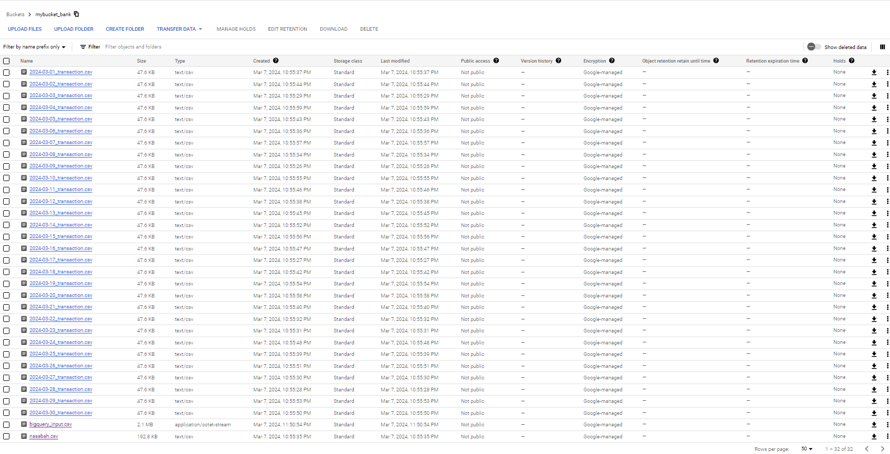
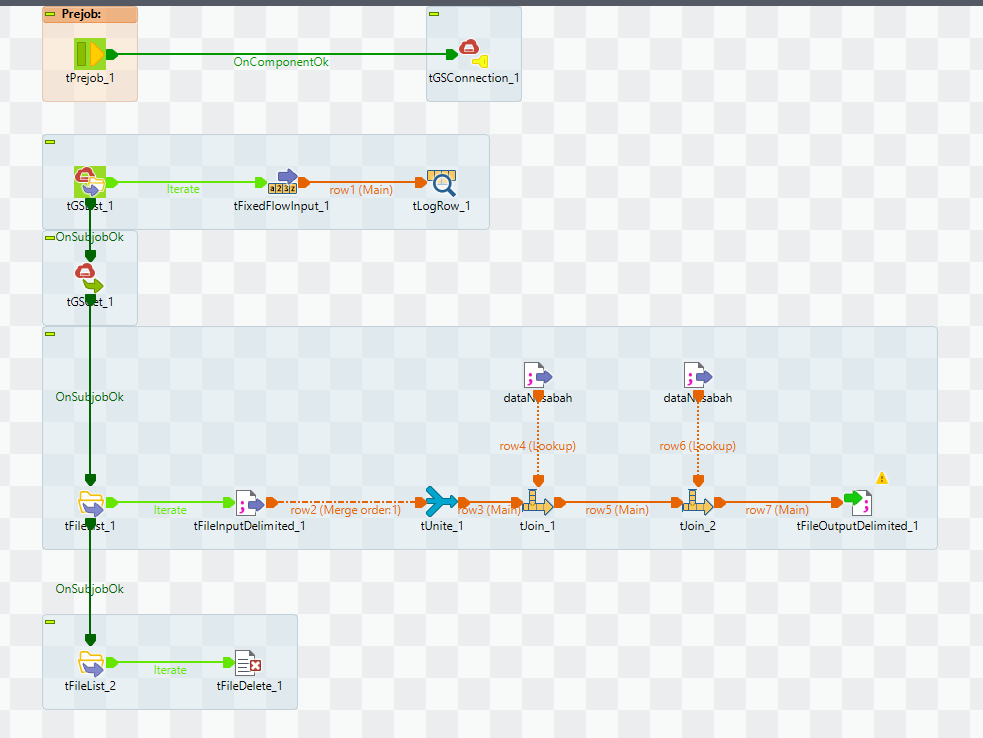
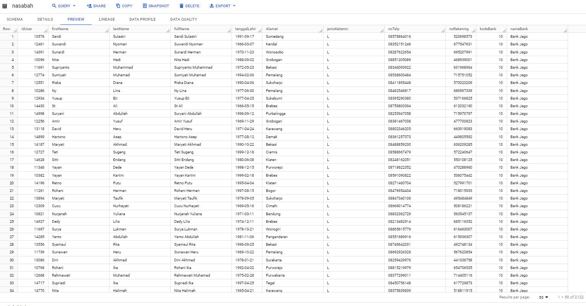
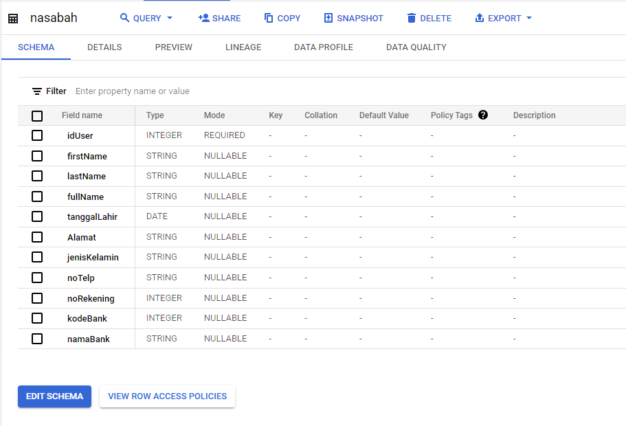
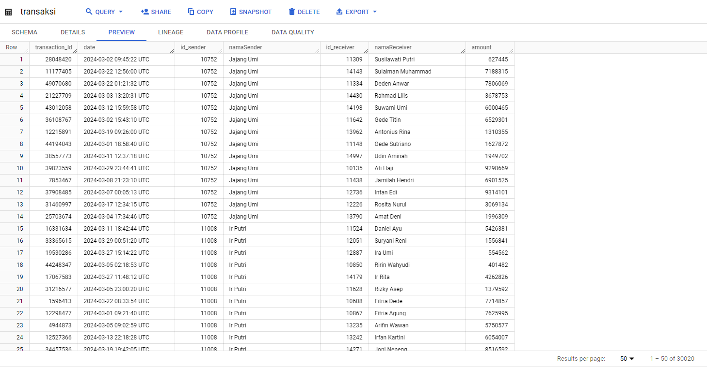
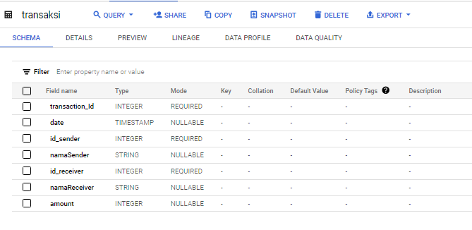
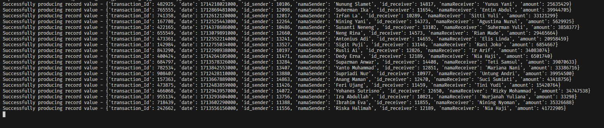
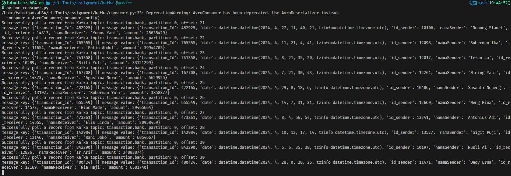

# PT Jasamedika Saranatama Test Case

## Description
This project aims to generate data from a specified file, then send it to BigQuery, integrated with Talend. The process in Talend involves creating a data warehouse. Once the data warehouse is set up, Kafka is utilized to stream data to the data warehouse in BigQuery.

## Table of Contents
1. [Random Data Generator](#random-data-generator)
2. [Upload File to Google Cloud Storage (GCS)](#upload-file-to-google-cloud-storage-gcs)
3. [Integration with Talend](#integration-with-talend)
4. [Data stream using Kafka](#data-streaming-using-kafka)

## Random Data Generator
The `random_data_generator.py` script employs PySpark to generate random data based on `nasabah.csv`. It creates random transaction IDs, dates, amounts, senders, and receivers. The generated data is then partitioned by date.

## Upload File to Google Cloud Storage (GCS)
The `upload_file_to_gcs.py` script facilitates exporting data to GCS using Python. It requires two arguments:
1. `--all`: Upload all CSV files in the same folder, each with its filename.
2. `--dest` and `--source`: Dependent arguments specifying the file to be uploaded and the filename on GCS.
Here's a screenshot of the bucker on GCS:

## Integration with Talend
## Description
This section outlines the integration process with Talend, specifically within the `MYPROJECT_TALEND` folder. The integration involves two jobs:

1. **Data Retrieval and Processing from Google Cloud Storage (GCS)**
   - Utilizes the Talend job to retrieve data from GCS.
   - Steps involved:
     - `tgsfilelist`: Lists all files in the specified bucket.
     - `tgsget`: Downloads all files from the bucket.
     - `tfilelist`: Lists all downloaded files.
     - Merges the downloaded files into a single file using an iteration loop.
     - Joins data from `nasabah.csv` with the merged file to obtain sender and receiver names.
     - Saves the processed file using `tfileinputdelimited`.
     - Deletes all files to clear space on the local machine using `tfiledelete`.
    - Here's the screenshot of the job:

    

2. **BigQuery Table Creation and Data Upload**
   - Utilizes the previous `nasabah.csv` to create a BigQuery table named "nasabah".
   - Subsequently, the merged file from the previous process is uploaded into BigQuery to the table called "transaksi".
   - This is the jobs looks like:

   
   ### Here's the nasabah table preview and schema:
   
   
   ### And this one is table preview and schema on transaction table:
   
   

## Data streaming using Kafka
## Description
This section elaborates on the use of Kafka. The Kafka integration involves the use of Docker Compose to set up Kafka infrastructure, including Confluent Kafka, Schema Registry, Zookeeper, etc. Avro type is used as the schema format, defined in `transaction_key.avsc` and `transaction_value.avsc`.

### Producer
- The producer utilizes the `nasabah.csv` to generate random data, producing it into a topic called `transaction.bank`.
    Here's the screenshot of data that generated on producer.py:

### Consumer
- Subscribes to the `transaction.bank` topic.
- Uses Google BigQuery's `insert_rows` function to insert streamed data into the `transaksi` table.
    Here's the screenshot of data that consumed and inserted into BigQuery:

